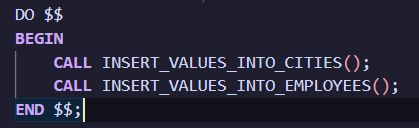

# Лабораторна №1

Мета: Підготувати середовище до виконання лабораторних робіт

## Встановлення docker у WSL

<details>
<summary>dymytryke@dymytryke:~/obnbd/lab1$ sudo apt install apt-transport-https ca-certificates curl software-properties-common</summary>

``` bash
Reading package lists... Done
Building dependency tree... Done
Reading state information... Done
ca-certificates is already the newest version (20240203).
ca-certificates set to manually installed.
curl is already the newest version (8.5.0-2ubuntu10.6).
curl set to manually installed.
software-properties-common is already the newest version (0.99.49.1).
software-properties-common set to manually installed.
The following NEW packages will be installed:
  apt-transport-https
0 upgraded, 1 newly installed, 0 to remove and 49 not upgraded.
Need to get 3974 B of archives.
After this operation, 35.8 kB of additional disk space will be used.
Do you want to continue? [Y/n] y
Get:1 http://archive.ubuntu.com/ubuntu noble/universe amd64 apt-transport-https all 2.7.14build2 [3974 B]
Fetched 3974 B in 0s (26.3 kB/s)             
debconf: unable to initialize frontend: Dialog
debconf: (Dialog frontend requires a screen at least 13 lines tall and 31 columns wide.)
debconf: falling back to frontend: Readline
Selecting previously unselected package apt-transport-https.
(Reading database ... 40794 files and directories currently installed.)
Preparing to unpack .../apt-transport-https_2.7.14build2_all.deb ...
Unpacking apt-transport-https (2.7.14build2) ...
Setting up apt-transport-https (2.7.14build2) ...
```
</details>

<details>
<summary>dymytryke@dymytryke:~/obnbd/lab1$ curl -fsSL https://download.docker.com/linux/ubuntu/gpg | sudo apt-key add -</summary>

```bash
Warning: apt-key is deprecated. Manage keyring files in trusted.gpg.d instead (see apt-key(8)).
OK
```
</details>

<details>
<summary>dymytryke@dymytryke:~/obnbd/lab1$ sudo add-apt-repository "deb [arch=amd64] https://download.docker.com/linux/ubuntu $(lsb_release -cs) stable"</summary>

```bash
Repository: 'deb [arch=amd64] https://download.docker.com/linux/ubuntu noble stable'
Description:
Archive for codename: noble components: stable
More info: https://download.docker.com/linux/ubuntu
Adding repository.
Press [ENTER] to continue or Ctrl-c to cancel.
Adding deb entry to /etc/apt/sources.list.d/archive_uri-https_download_docker_com_linux_ubuntu-noble.list
Adding disabled deb-src entry to /etc/apt/sources.list.d/archive_uri-https_download_docker_com_linux_ubuntu-noble.list
Hit:1 http://archive.ubuntu.com/ubuntu noble InRelease
Get:2 http://archive.ubuntu.com/ubuntu noble-updates InRelease [126 kB]                                   
Get:3 http://security.ubuntu.com/ubuntu noble-security InRelease [126 kB]                                 
Get:4 https://download.docker.com/linux/ubuntu noble InRelease [48.8 kB]                
Get:5 https://download.docker.com/linux/ubuntu noble/stable amd64 Packages [18.9 kB]                  
Get:6 http://archive.ubuntu.com/ubuntu noble-backports InRelease [126 kB]
Get:7 http://archive.ubuntu.com/ubuntu noble-updates/main amd64 Packages [838 kB]
Get:8 http://security.ubuntu.com/ubuntu noble-security/main amd64 Packages [615 kB]
Get:9 http://archive.ubuntu.com/ubuntu noble-updates/main Translation-en [191 kB]
Get:10 http://archive.ubuntu.com/ubuntu noble-updates/main amd64 Components [151 kB]           
Get:11 http://archive.ubuntu.com/ubuntu noble-updates/universe amd64 Packages [1003 kB]           
Get:12 http://archive.ubuntu.com/ubuntu noble-updates/universe Translation-en [250 kB]    
Get:13 http://security.ubuntu.com/ubuntu noble-security/main Translation-en [118 kB]       
Get:14 http://archive.ubuntu.com/ubuntu noble-updates/universe amd64 Components [315 kB]                        
Get:15 http://security.ubuntu.com/ubuntu noble-security/main amd64 Components [8940 B]                            
Get:16 http://security.ubuntu.com/ubuntu noble-security/universe amd64 Packages [803 kB]                           
Get:17 http://archive.ubuntu.com/ubuntu noble-updates/restricted amd64 Packages [631 kB]                   
Get:18 http://archive.ubuntu.com/ubuntu noble-updates/restricted Translation-en [121 kB]           
Get:19 http://archive.ubuntu.com/ubuntu noble-updates/restricted amd64 Components [212 B]               
Get:20 http://archive.ubuntu.com/ubuntu noble-updates/multiverse amd64 Packages [16.3 kB]                 
Get:21 http://archive.ubuntu.com/ubuntu noble-updates/multiverse Translation-en [3944 B]                  
Get:22 http://archive.ubuntu.com/ubuntu noble-updates/multiverse amd64 Components [940 B]                 
Get:23 http://archive.ubuntu.com/ubuntu noble-backports/main amd64 Components [208 B]                     
Get:24 http://archive.ubuntu.com/ubuntu noble-backports/universe amd64 Components [17.7 kB]               
Get:25 http://security.ubuntu.com/ubuntu noble-security/universe Translation-en [171 kB]            
Get:26 http://security.ubuntu.com/ubuntu noble-security/universe amd64 Components [52.0 kB]
Get:27 http://security.ubuntu.com/ubuntu noble-security/restricted amd64 Packages [620 kB]
Get:28 http://archive.ubuntu.com/ubuntu noble-backports/restricted amd64 Components [216 B]
Get:29 http://archive.ubuntu.com/ubuntu noble-backports/multiverse amd64 Components [212 B]       
Get:30 http://security.ubuntu.com/ubuntu noble-security/restricted Translation-en [119 kB]
Get:31 http://security.ubuntu.com/ubuntu noble-security/restricted amd64 Components [212 B]
Get:32 http://security.ubuntu.com/ubuntu noble-security/multiverse amd64 Components [212 B]
Fetched 6495 kB in 1s (5811 kB/s)                
Reading package lists... Done
W: https://download.docker.com/linux/ubuntu/dists/noble/InRelease: Key is stored in legacy trusted.gpg keyring (/etc/apt/trusted.gpg), see the DEPRECATION section in apt-key(8) for details.
```
</details>

<details>
<summary>dymytryke@dymytryke:~/obnbd/lab1$ sudo apt update</summary>

```bash
Hit:1 https://download.docker.com/linux/ubuntu noble InRelease
Hit:2 http://archive.ubuntu.com/ubuntu noble InRelease
Hit:3 http://security.ubuntu.com/ubuntu noble-security InRelease
Hit:4 http://archive.ubuntu.com/ubuntu noble-updates InRelease
Hit:5 http://archive.ubuntu.com/ubuntu noble-backports InRelease
Reading package lists... Done
Building dependency tree... Done
Reading state information... Done
71 packages can be upgraded. Run 'apt list --upgradable' to see them.
W: https://download.docker.com/linux/ubuntu/dists/noble/InRelease: Key is stored in legacy trusted.gpg keyring (/etc/apt/trusted.gpg), see the DEPRECATION section in apt-key(8) for details.
```
</details>

<details>
<summary>dymytryke@dymytryke:~/obnbd/lab1$ apt-cache policy docker-ce</summary>

```bash
Warning: apt-key is deprecated. Manage keyring files in trusted.gpg.d instead (see apt-key(8)).
OK
```
</details>

<details>
<summary>dymytryke@dymytryke:~/obnbd/lab1$ curl -fsSL https://download.docker.com/linux/ubuntu/gpg | sudo apt-key add -</summary>

```bash
docker-ce:
  Installed: (none)
  Candidate: 5:27.5.1-1~ubuntu.24.04~noble
  Version table:
     5:27.5.1-1~ubuntu.24.04~noble 500
        500 https://download.docker.com/linux/ubuntu noble/stable amd64 Packages
     5:27.5.0-1~ubuntu.24.04~noble 500
        500 https://download.docker.com/linux/ubuntu noble/stable amd64 Packages
     5:27.4.1-1~ubuntu.24.04~noble 500
        500 https://download.docker.com/linux/ubuntu noble/stable amd64 Packages
     5:27.4.0-1~ubuntu.24.04~noble 500
        500 https://download.docker.com/linux/ubuntu noble/stable amd64 Packages
     5:27.3.1-1~ubuntu.24.04~noble 500
        500 https://download.docker.com/linux/ubuntu noble/stable amd64 Packages
     5:27.3.0-1~ubuntu.24.04~noble 500
        500 https://download.docker.com/linux/ubuntu noble/stable amd64 Packages
     5:27.2.1-1~ubuntu.24.04~noble 500
        500 https://download.docker.com/linux/ubuntu noble/stable amd64 Packages
     5:27.2.0-1~ubuntu.24.04~noble 500
        500 https://download.docker.com/linux/ubuntu noble/stable amd64 Packages
     5:27.1.2-1~ubuntu.24.04~noble 500
        500 https://download.docker.com/linux/ubuntu noble/stable amd64 Packages
     5:27.1.1-1~ubuntu.24.04~noble 500
        500 https://download.docker.com/linux/ubuntu noble/stable amd64 Packages
     5:27.1.0-1~ubuntu.24.04~noble 500
        500 https://download.docker.com/linux/ubuntu noble/stable amd64 Packages
     5:27.0.3-1~ubuntu.24.04~noble 500
        500 https://download.docker.com/linux/ubuntu noble/stable amd64 Packages
     5:27.0.2-1~ubuntu.24.04~noble 500
        500 https://download.docker.com/linux/ubuntu noble/stable amd64 Packages
     5:27.0.1-1~ubuntu.24.04~noble 500
        500 https://download.docker.com/linux/ubuntu noble/stable amd64 Packages
     5:26.1.4-1~ubuntu.24.04~noble 500
        500 https://download.docker.com/linux/ubuntu noble/stable amd64 Packages
     5:26.1.3-1~ubuntu.24.04~noble 500
        500 https://download.docker.com/linux/ubuntu noble/stable amd64 Packages
     5:26.1.2-1~ubuntu.24.04~noble 500
        500 https://download.docker.com/linux/ubuntu noble/stable amd64 Packages
     5:26.1.1-1~ubuntu.24.04~noble 500
        500 https://download.docker.com/linux/ubuntu noble/stable amd64 Packages
     5:26.1.0-1~ubuntu.24.04~noble 500
        500 https://download.docker.com/linux/ubuntu noble/stable amd64 Packages
     5:26.0.2-1~ubuntu.24.04~noble 500
        500 https://download.docker.com/linux/ubuntu noble/stable amd64 Packages
     5:26.0.1-1~ubuntu.24.04~noble 500
        500 https://download.docker.com/linux/ubuntu noble/stable amd64 Packages
     5:26.0.0-1~ubuntu.24.04~noble 500
        500 https://download.docker.com/linux/ubuntu noble/stable amd64 Packages
```
</details>

<details>
<summary>dymytryke@dymytryke:~/obnbd/lab1$ sudo apt install docker-ce</summary>

```bash
Reading package lists... Done
Building dependency tree... Done
Reading state information... Done
The following additional packages will be installed:
  containerd.io docker-buildx-plugin docker-ce-cli docker-ce-rootless-extras docker-compose-plugin iptables libip4tc2 libip6tc2 libltdl7 libnetfilter-conntrack3
  libnfnetlink0 libnftables1 libnftnl11 libslirp0 nftables pigz slirp4netns
Suggested packages:
  aufs-tools cgroupfs-mount | cgroup-lite firewalld
The following NEW packages will be installed:
  containerd.io docker-buildx-plugin docker-ce docker-ce-cli docker-ce-rootless-extras docker-compose-plugin iptables libip4tc2 libip6tc2 libltdl7
  libnetfilter-conntrack3 libnfnetlink0 libnftables1 libnftnl11 libslirp0 nftables pigz slirp4netns
0 upgraded, 18 newly installed, 0 to remove and 71 not upgraded.
Need to get 128 MB of archives.
After this operation, 462 MB of additional disk space will be used.
Do you want to continue? [Y/n] y
Get:1 https://download.docker.com/linux/ubuntu noble/stable amd64 containerd.io amd64 1.7.25-1 [29.6 MB]
Get:2 http://archive.ubuntu.com/ubuntu noble/universe amd64 pigz amd64 2.8-1 [65.6 kB]
Get:3 http://archive.ubuntu.com/ubuntu noble/main amd64 libip4tc2 amd64 1.8.10-3ubuntu2 [23.3 kB]
Get:4 http://archive.ubuntu.com/ubuntu noble/main amd64 libip6tc2 amd64 1.8.10-3ubuntu2 [23.7 kB]
Get:5 http://archive.ubuntu.com/ubuntu noble/main amd64 libnfnetlink0 amd64 1.0.2-2build1 [14.8 kB]
Get:6 http://archive.ubuntu.com/ubuntu noble/main amd64 libnetfilter-conntrack3 amd64 1.0.9-6build1 [45.2 kB]
Get:7 http://archive.ubuntu.com/ubuntu noble/main amd64 libnftnl11 amd64 1.2.6-2build1 [66.0 kB]
Get:8 http://archive.ubuntu.com/ubuntu noble/main amd64 iptables amd64 1.8.10-3ubuntu2 [381 kB]
Get:9 http://archive.ubuntu.com/ubuntu noble/main amd64 libnftables1 amd64 1.0.9-1build1 [358 kB]
Get:10 http://archive.ubuntu.com/ubuntu noble/main amd64 nftables amd64 1.0.9-1build1 [69.8 kB]
Get:11 http://archive.ubuntu.com/ubuntu noble/main amd64 libltdl7 amd64 2.4.7-7build1 [40.3 kB]
Get:12 http://archive.ubuntu.com/ubuntu noble/main amd64 libslirp0 amd64 4.7.0-1ubuntu3 [63.8 kB]
Get:13 http://archive.ubuntu.com/ubuntu noble/universe amd64 slirp4netns amd64 1.2.1-1build2 [34.9 kB]
Get:14 https://download.docker.com/linux/ubuntu noble/stable amd64 docker-buildx-plugin amd64 0.20.0-1~ubuntu.24.04~noble [33.2 MB]
Get:15 https://download.docker.com/linux/ubuntu noble/stable amd64 docker-ce-cli amd64 5:27.5.1-1~ubuntu.24.04~noble [15.2 MB]
Get:16 https://download.docker.com/linux/ubuntu noble/stable amd64 docker-ce amd64 5:27.5.1-1~ubuntu.24.04~noble [26.1 MB]
Get:17 https://download.docker.com/linux/ubuntu noble/stable amd64 docker-ce-rootless-extras amd64 5:27.5.1-1~ubuntu.24.04~noble [9601 kB]
Get:18 https://download.docker.com/linux/ubuntu noble/stable amd64 docker-compose-plugin amd64 2.32.4-1~ubuntu.24.04~noble [12.8 MB]
Fetched 128 MB in 3s (48.0 MB/s)                 
debconf: unable to initialize frontend: Dialog
debconf: (Dialog frontend requires a screen at least 13 lines tall and 31 columns wide.)
debconf: falling back to frontend: Readline
Selecting previously unselected package pigz.
(Reading database ... 40798 files and directories currently installed.)
Preparing to unpack .../00-pigz_2.8-1_amd64.deb ...
Unpacking pigz (2.8-1) ...
Selecting previously unselected package libip4tc2:amd64.
Preparing to unpack .../01-libip4tc2_1.8.10-3ubuntu2_amd64.deb ...
Unpacking libip4tc2:amd64 (1.8.10-3ubuntu2) ...
Selecting previously unselected package libip6tc2:amd64.
Preparing to unpack .../02-libip6tc2_1.8.10-3ubuntu2_amd64.deb ...
Unpacking libip6tc2:amd64 (1.8.10-3ubuntu2) ...
Selecting previously unselected package libnfnetlink0:amd64.
Preparing to unpack .../03-libnfnetlink0_1.0.2-2build1_amd64.deb ...
Unpacking libnfnetlink0:amd64 (1.0.2-2build1) ...
Selecting previously unselected package libnetfilter-conntrack3:amd64.
Preparing to unpack .../04-libnetfilter-conntrack3_1.0.9-6build1_amd64.deb ...
Unpacking libnetfilter-conntrack3:amd64 (1.0.9-6build1) ...
Selecting previously unselected package libnftnl11:amd64.
Preparing to unpack .../05-libnftnl11_1.2.6-2build1_amd64.deb ...
Unpacking libnftnl11:amd64 (1.2.6-2build1) ...
Selecting previously unselected package iptables.
Preparing to unpack .../06-iptables_1.8.10-3ubuntu2_amd64.deb ...
Unpacking iptables (1.8.10-3ubuntu2) ...
Selecting previously unselected package libnftables1:amd64.
Preparing to unpack .../07-libnftables1_1.0.9-1build1_amd64.deb ...
Unpacking libnftables1:amd64 (1.0.9-1build1) ...
Selecting previously unselected package nftables.
Preparing to unpack .../08-nftables_1.0.9-1build1_amd64.deb ...
Unpacking nftables (1.0.9-1build1) ...
Selecting previously unselected package containerd.io.
Preparing to unpack .../09-containerd.io_1.7.25-1_amd64.deb ...
Unpacking containerd.io (1.7.25-1) ...
Selecting previously unselected package docker-buildx-plugin.
Preparing to unpack .../10-docker-buildx-plugin_0.20.0-1~ubuntu.24.04~noble_amd64.deb ...
Unpacking docker-buildx-plugin (0.20.0-1~ubuntu.24.04~noble) ...
Selecting previously unselected package docker-ce-cli.
Preparing to unpack .../11-docker-ce-cli_5%3a27.5.1-1~ubuntu.24.04~noble_amd64.deb ...
Unpacking docker-ce-cli (5:27.5.1-1~ubuntu.24.04~noble) ...
Selecting previously unselected package docker-ce.
Preparing to unpack .../12-docker-ce_5%3a27.5.1-1~ubuntu.24.04~noble_amd64.deb ...
Unpacking docker-ce (5:27.5.1-1~ubuntu.24.04~noble) ...
Selecting previously unselected package docker-ce-rootless-extras.
Preparing to unpack .../13-docker-ce-rootless-extras_5%3a27.5.1-1~ubuntu.24.04~noble_amd64.deb ...
Unpacking docker-ce-rootless-extras (5:27.5.1-1~ubuntu.24.04~noble) ...
Selecting previously unselected package docker-compose-plugin.
Preparing to unpack .../14-docker-compose-plugin_2.32.4-1~ubuntu.24.04~noble_amd64.deb ...
Unpacking docker-compose-plugin (2.32.4-1~ubuntu.24.04~noble) ...
Selecting previously unselected package libltdl7:amd64.
Preparing to unpack .../15-libltdl7_2.4.7-7build1_amd64.deb ...
Unpacking libltdl7:amd64 (2.4.7-7build1) ...
Selecting previously unselected package libslirp0:amd64.
Preparing to unpack .../16-libslirp0_4.7.0-1ubuntu3_amd64.deb ...
Unpacking libslirp0:amd64 (4.7.0-1ubuntu3) ...
Selecting previously unselected package slirp4netns.
Preparing to unpack .../17-slirp4netns_1.2.1-1build2_amd64.deb ...
Unpacking slirp4netns (1.2.1-1build2) ...
Setting up libip4tc2:amd64 (1.8.10-3ubuntu2) ...
Setting up libip6tc2:amd64 (1.8.10-3ubuntu2) ...
Setting up libnftnl11:amd64 (1.2.6-2build1) ...
Setting up docker-buildx-plugin (0.20.0-1~ubuntu.24.04~noble) ...
Setting up containerd.io (1.7.25-1) ...
Created symlink /etc/systemd/system/multi-user.target.wants/containerd.service → /usr/lib/systemd/system/containerd.service.
Setting up docker-compose-plugin (2.32.4-1~ubuntu.24.04~noble) ...
Setting up libltdl7:amd64 (2.4.7-7build1) ...
Setting up docker-ce-cli (5:27.5.1-1~ubuntu.24.04~noble) ...
Setting up libslirp0:amd64 (4.7.0-1ubuntu3) ...
Setting up pigz (2.8-1) ...
Setting up libnfnetlink0:amd64 (1.0.2-2build1) ...
Setting up docker-ce-rootless-extras (5:27.5.1-1~ubuntu.24.04~noble) ...
Setting up libnftables1:amd64 (1.0.9-1build1) ...
Setting up nftables (1.0.9-1build1) ...
Setting up slirp4netns (1.2.1-1build2) ...
Setting up libnetfilter-conntrack3:amd64 (1.0.9-6build1) ...
Setting up iptables (1.8.10-3ubuntu2) ...
update-alternatives: using /usr/sbin/iptables-legacy to provide /usr/sbin/iptables (iptables) in auto mode
update-alternatives: using /usr/sbin/ip6tables-legacy to provide /usr/sbin/ip6tables (ip6tables) in auto mode
update-alternatives: using /usr/sbin/iptables-nft to provide /usr/sbin/iptables (iptables) in auto mode
update-alternatives: using /usr/sbin/ip6tables-nft to provide /usr/sbin/ip6tables (ip6tables) in auto mode
update-alternatives: using /usr/sbin/arptables-nft to provide /usr/sbin/arptables (arptables) in auto mode
update-alternatives: using /usr/sbin/ebtables-nft to provide /usr/sbin/ebtables (ebtables) in auto mode
Setting up docker-ce (5:27.5.1-1~ubuntu.24.04~noble) ...
Created symlink /etc/systemd/system/multi-user.target.wants/docker.service → /usr/lib/systemd/system/docker.service.
Created symlink /etc/systemd/system/sockets.target.wants/docker.socket → /usr/lib/systemd/system/docker.socket.
Processing triggers for man-db (2.12.0-4build2) ...
Processing triggers for libc-bin (2.39-0ubuntu8.3) ...
```
</details>

<details>
<summary>dymytryke@dymytryke:~/obnbd/lab1$ sudo systemctl status docker</summary>

```bash
● docker.service - Docker Application Container Engine
     Loaded: loaded (/usr/lib/systemd/system/docker.service; enabled; preset: enabled)
     Active: active (running) since Mon 2025-02-03 21:32:53 UTC; 2s ago
TriggeredBy: ● docker.socket
       Docs: https://docs.docker.com
   Main PID: 6493 (dockerd)
      Tasks: 16
     Memory: 43.3M ()
     CGroup: /system.slice/docker.service
             └─6493 /usr/bin/dockerd -H fd:// --containerd=/run/containerd/containerd.sock
```
</details>

## Встановлення та налаштування СУБД

[Docker compose file](./docker-compose.yml)

### DBMS startup


### Connection to the DB


### Init DB structure (create tables, procedures)

The DB structure init was performed through [Initialization scripts](https://hub.docker.com/_/postgres#:~:text=and%20POSTGRES_DB.-,Initialization%20scripts,-If%20you%20would). I added the scripts to a directory and mounted that directory to /docker-entrypoint-initdb.d directory in the container. These initialization files will be executed in sorted name order as defined by the current locale, which defaults to en_US.utf8, so i prepended numbers to ensure the correct order of execution.

**Important:** the initialization files will not be run if the data directory is not empty.
 
Results:


### Populate the DB with data

Now we execute the created procedures to populate tables with data (randomly generated):




Results of the procedures execution:


### Hierarchy

