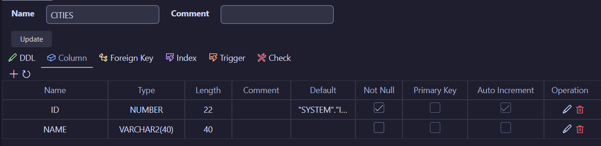
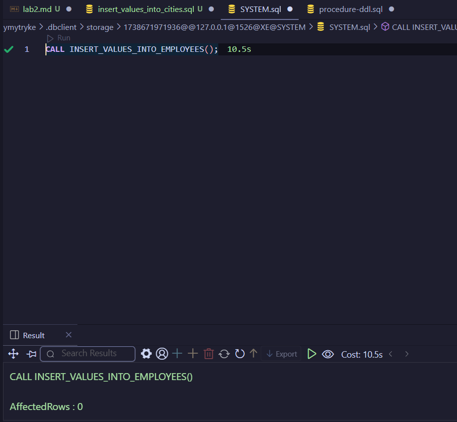
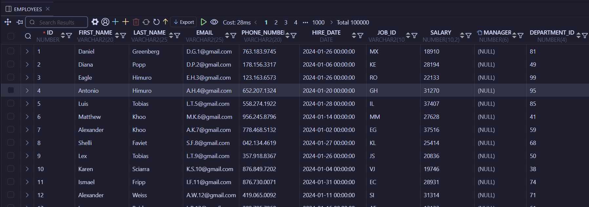

# Лабораторна №2

Мета: Заповнити таблиці даними

## Create tables

[CITIES](./tables/CITIES.sql)

Result:

[EMPLOYEES](./tables/EMPLOYEES.sql)

Result:

## Create procedures

[INSERT_CITIES](./inserts/insert_values_into_cities.sql)

Result:

[GENERATE_RANDOM_PHONE_NUMBER](./inserts/generate_random_phone_number.sql)

Result:

[INSERT_EMPLOYEES](./inserts/insert_values_into_employees.sql)

Result:

## Execute procedures

Execution:

Results:

