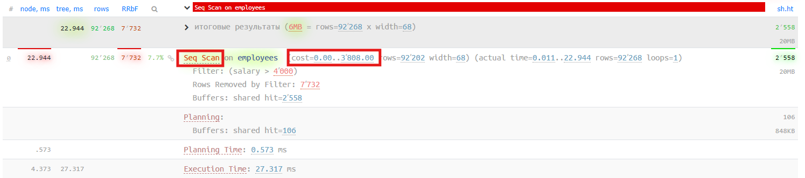
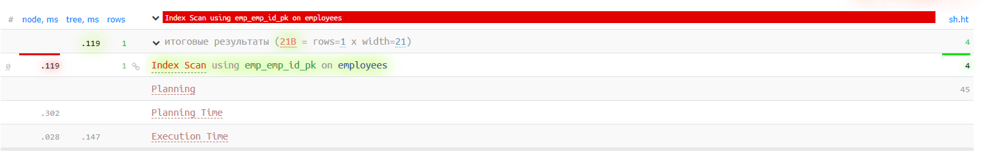
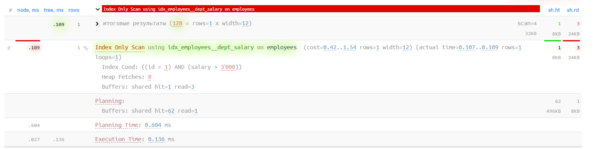
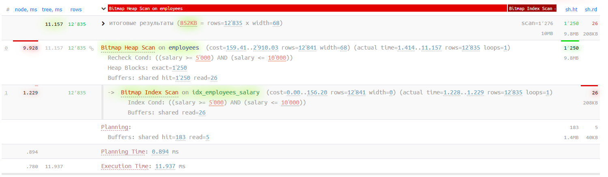
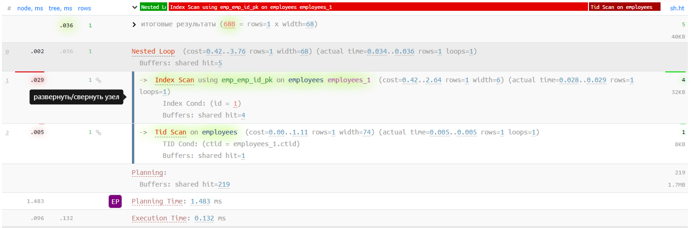
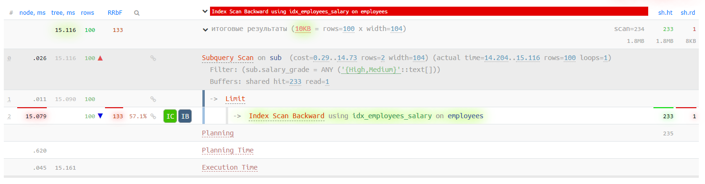
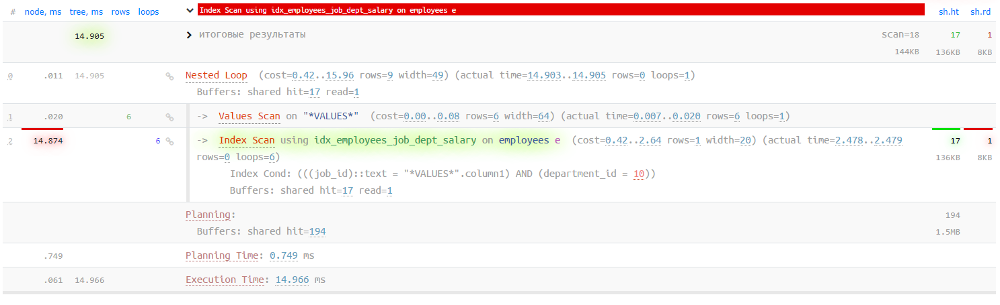
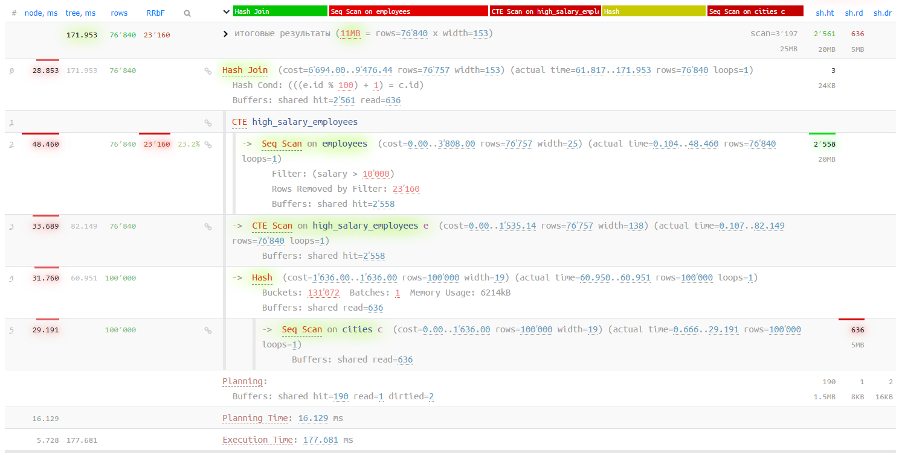
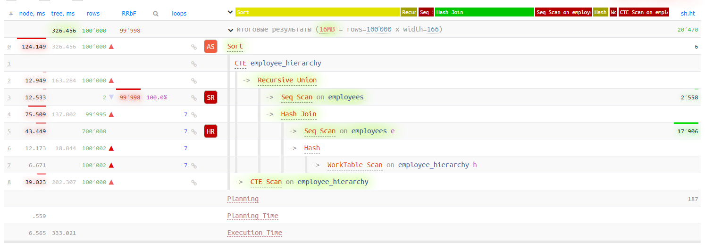

# Lab 2

```sql
CREATE INDEX idx_employees_salary ON EMPLOYEES(salary);
CREATE INDEX idx_employees_job_id ON EMPLOYEES(job_id);
CREATE INDEX idx_employees_department_id ON EMPLOYEES(department_id);
CREATE INDEX idx_employees_hire_date ON EMPLOYEES(hire_date);
```

## 1. Seq scan

**Sequential scan (послідовне сканування)** - це найпростіший метод сканування, при якому PostgreSQL переглядає кожен рядок таблиці послідовно. У цьому прикладі, незважаючи на наявність індексу на стовпці salary, оптимізатор вирішив використати послідовне сканування, оскільки умова salary > 4000 може повертати значну кількість рядків. Коли запит повертає великий відсоток даних з таблиці, послідовне сканування часто ефективніше, ніж використання індексу.

```sql
SELECT * FROM employees
WHERE salary > 4000;
```



## 2. Index scan

**Index scan (сканування за індексом)** використовується, коли PostgreSQL використовує індекс для пошуку конкретних рядків, а потім звертається до таблиці для отримання повних даних рядків. У цьому випадку використовується первинний ключ id для швидкого пошуку одного конкретного запису. Оскільки ми шукаємо за точним значенням первинного ключа, це ідеальний випадок для використання індексного сканування, яке значно швидше ніж послідовне сканування всієї таблиці.

```sql
SELECT id, first_name, last_name, salary
FROM employees
WHERE id = '1';
```




## 3. Index only scan

**Index only scan (сканування тільки за індексом)** - це оптимізована форма індексного сканування, яка використовується, коли всі стовпці, необхідні для запиту, містяться в самому індексі. У цьому випадку ми створили складений індекс, який включає всі поля, необхідні для запиту (id, department_id, salary). Це дозволяє PostgreSQL отримати всі необхідні дані безпосередньо з індексу, без необхідності звертатися до таблиці, що значно підвищує продуктивність.

Створимо індекс для index only scan.

```sql
CREATE INDEX idx_employees__dept_salary ON employees(id, department_id, salary);
```

```sql
SELECT id,department_id,salary
FROM employees
WHERE id='1' AND salary > 3000;
```



## 4. Bitmap index scan & 5. Bitmap heap scan

Bitmap index scan і Bitmap heap scan працюють разом як двоетапний процес:

1. Bitmap index scan - спочатку PostgreSQL використовує індекс для створення бітової карти (bitmap), де кожен біт відповідає рядку таблиці. Біти встановлюються в 1 для рядків, які відповідають умові запиту.
Bitmap heap scan - потім PostgreSQL використовує цю бітову карту для ефективного вибору потрібних рядків з таблиці.

2. Цей метод особливо ефективний, коли запит повертає значну кількість рядків, але не настільки багато, щоб виправдати послідовне сканування. У нашому випадку, для пошуку співробітників із зарплатою між 5000 і 10000, цей метод оптимальний, оскільки він дозволяє ефективно відфільтрувати дані за допомогою індексу, а потім отримати повні рядки з таблиці.

```sql
SELECT * FROM employees
WHERE salary BETWEEN 5000 AND 10000;
```



## 6. Tid scan

**TID (Tuple Identifier) scan** - це спеціалізований тип сканування, який використовується для доступу до конкретних фізичних розташувань рядків у таблиці. ctid - це системний стовпець, який містить фізичну адресу рядка в таблиці (номер сторінки і номер рядка на сторінці). TID scan використовується рідко в звичайних запитах, але може бути дуже ефективним, коли точне фізичне розташування рядків відоме заздалегідь. У цьому прикладі ми використовуємо підзапит для отримання ctid співробітника з id = 1, а потім використовуємо цей ctid для безпосереднього доступу до рядка.

```sql
SELECT * FROM EMPLOYEES
WHERE ctid IN (
    SELECT ctid FROM employees
    WHERE id = 1
);
```



## 7. Subquery scan

**Subquery scan (сканування підзапиту)** використовується, коли PostgreSQL повинен опрацювати результати підзапиту як окрему таблицю. У цьому випадку внутрішній підзапит створює набір даних з обчисленими полями (full_name, salary_grade), а зовнішній запит додатково фільтрує ці результати і додає нове поле employee_level. Subquery scan дозволяє PostgreSQL ефективно обробляти складні запити з вкладеними операціями, розбиваючи їх на логічні етапи обробки.

```sql
SELECT sub.*, 
       CASE 
           WHEN sub.salary_grade = 'High' THEN 'Executive'
           WHEN sub.salary_grade = 'Medium' THEN 'Manager'
           ELSE 'Staff'
       END AS employee_level
FROM (
    SELECT id, 
           first_name || ' ' || last_name AS full_name,
           salary,
           CASE 
               WHEN salary > 20000 THEN 'High'
               WHEN salary > 10000 THEN 'Medium'
               ELSE 'Low'
           END AS salary_grade
    FROM employees
    WHERE department_id BETWEEN 10 AND 50
    ORDER BY salary DESC
    LIMIT 100
) AS sub
WHERE sub.salary_grade IN ('High', 'Medium');
```



## 8. Function scan

**Function scan (сканування функції)** використовується, коли PostgreSQL викликає функцію, яка повертає набір рядків (SETOF). У цьому прикладі ми створили функцію get_dept_employees, яка повертає всіх співробітників з вказаного відділу. При виклику цієї функції PostgreSQL використовує Function scan для отримання результатів, які функція повертає. Це корисно для інкапсуляції складної логіки вибірки даних в функцію, яку можна багаторазово використовувати.

Створимо функцію що повертатиме таблицю.

```sql
CREATE OR REPLACE FUNCTION get_dept_employees(dept_id INTEGER) 
RETURNS SETOF EMPLOYEES AS $$
BEGIN
    RETURN QUERY 
    SELECT * FROM EMPLOYEES WHERE department_id = dept_id;
END;
$$ LANGUAGE plpgsql;
```

```sql
SELECT * FROM get_dept_employees(10);
```


## 9. Values scan

**Values scan (сканування значень)** використовується, коли PostgreSQL обробляє набір значень, явно заданих в запиті за допомогою конструкції VALUES. У цьому прикладі ми створюємо тимчасову таблицю посад (j) безпосередньо в запиті і з'єднуємо її з таблицею співробітників. Values scan дозволяє ефективно використовувати невеликі набори даних безпосередньо в запитах, без необхідності створення тимчасових таблиць або додаткових об'єктів бази даних.

```sql
SELECT e.id, e.first_name, e.last_name, j.job_title
FROM EMPLOYEES e
JOIN (
    VALUES 
        ('AD_PRES', 'President'),
        ('IT_PROG', 'Programmer'),
        ('SA_REP', 'Sales Representative'),
        ('FI_ACCOUNT', 'Accountant'),
        ('HR_REP', 'HR Representative'),
        ('MK_REP', 'Marketing Representative')
) AS j(job_id, job_title)
ON e.job_id = j.job_id
WHERE e.department_id = 10;
```



## 10. CTE scan

**CTE (Common Table Expression) scan** використовується для обробки даних з CTE (загальних табличних виразів), створених за допомогою конструкції WITH. У цьому прикладі ми використовуємо CTE з ключовим словом MATERIALIZED, що змушує PostgreSQL матеріалізувати результати CTE (зберегти їх в пам'яті) перед виконанням основного запиту. Це корисно, коли CTE використовується кілька разів у запиті або коли повторне обчислення CTE було б неефективним. CTE scan дозволяє структурувати складні запити в більш читабельні і логічні блоки.

```sql
WITH high_salary_employees AS MATERIALIZED (
    SELECT id, first_name, last_name, salary, department_id
    FROM EMPLOYEES
    WHERE salary > 10000
)
SELECT e.*, c.name AS city_name
FROM high_salary_employees e
CROSS JOIN CITIES c
WHERE c.id = (e.id % 100) + 1;
```




## 11. Worktable scan

**Worktable scan** використовується при обробці рекурсивних запитів або інших операцій, які вимагають тимчасового зберігання проміжних результатів. У цьому прикладі ми використовуємо рекурсивний CTE для побудови ієрархії співробітників, починаючи з верхнього рівня (співробітники без менеджерів) і поступово додаючи підлеглих. PostgreSQL використовує worktable для зберігання проміжних результатів рекурсії, а worktable scan - для доступу до цих даних на кожній ітерації рекурсивного процесу. Цей метод дозволяє ефективно вирішувати задачі з ієрархічними структурами даних, такими як організаційні діаграми, дерева категорій тощо.


```sql
WITH RECURSIVE employee_hierarchy AS (
    -- Base case: top-level employee (CEO/president with no manager)
    SELECT id, first_name, last_name, manager_id, 1 AS level
    FROM EMPLOYEES
    WHERE manager_id IS NULL
    
    UNION ALL
    
    -- Recursive case: employees reporting to managers in the hierarchy
    SELECT e.id, e.first_name, e.last_name, e.manager_id, h.level + 1
    FROM EMPLOYEES e
    JOIN employee_hierarchy h ON e.manager_id = h.id
)
SELECT 
    id,
    first_name,
    last_name,
    level,
    repeat('  ', level - 1) || first_name || ' ' || last_name AS org_chart_view
FROM employee_hierarchy
ORDER BY level, last_name, first_name;
```

