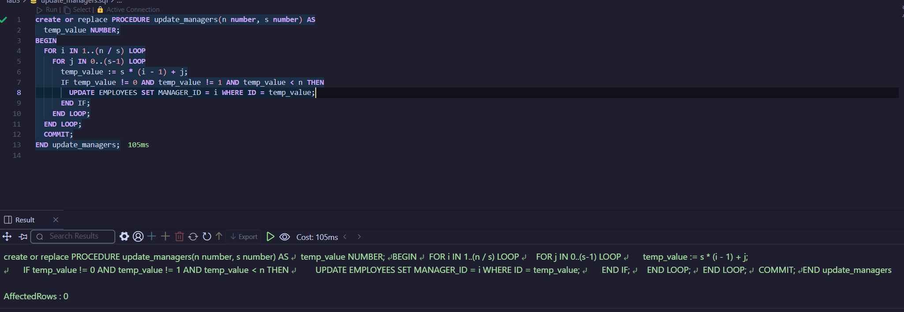
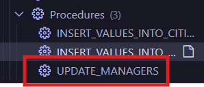
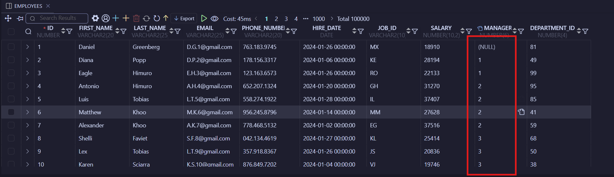
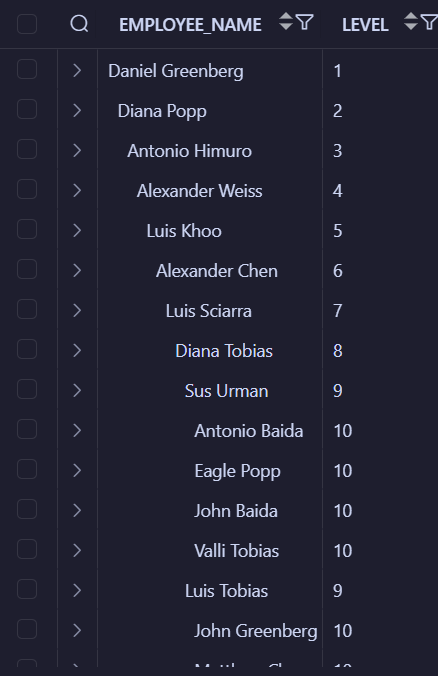

# Лабораторна 3

Мета: Оновити таблиці

## Хід роботи

Створення процедури:

[update_managers](./sql/update_managers.sql)

Виконання процедури:

Результат:

[select_hierarchy](./sql/select_hierarchy.sql)

