# Частина 1. Хінти без pg_hint_plan (непрямий вплив)
## 1.1. Аналіз плану виконання
Отримайте план цього запиту:
```postgresql
SELECT * FROM employees WHERE salary > 10000;
```

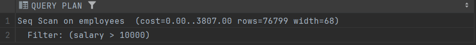
## 1.2. Вплив через вимкнення типів сканування
Виконайте і після цього оцініть план запиту з пункту 1.1:
```postgresql
SET enable_seqscan = off;
```

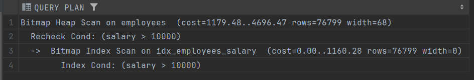

Змінився план запиту. Тепер використовується Bitmap Index Scan + Bitmap Heap Scan. Команда вище змушує планувальник не використовувати послідовне сканування.
## 1.3. Зміна параметрів cost
Виконайте і після цього оцініть план запиту з пункту 1.1:
```postgresql
SET random_page_cost = 1.0;
SET seq_page_cost = 10.0;
```

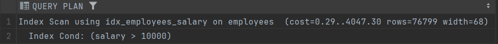

На відміну від пункту 1.2, зараз послідовне сканування увімкнено, але планувальник обрав Index Scan, бо команда random_page_cost = 1.0 заохотила використання індексу, а seq_page_cost = 10.0 знеохотила Seq Scan. 
# Частина 2. Прямі хінти з pg_hint_plan
Якщо pg_hint_plan не встановлено — встановіть і активуйте розширення:
```postgresql
CREATE EXTENSION IF NOT EXISTS pg_hint_plan;
--CREATE EXTENSION pg_hint_plan;
```

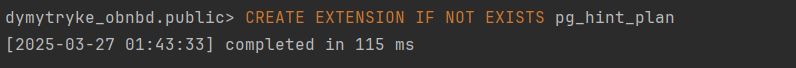
## 2.1. Хінт IndexScan
Створіть індекс, якщо ще не створено. Або використайте інший індекс:
```postgresql
CREATE INDEX idx_employees_salary ON employees(salary);
```
Оцініть план з хінтом і без нього:
```postgresql
/*+ IndexScan(employees idx_employees_salary) */
SELECT * FROM employees WHERE salary > 10000;
```

Без хінта

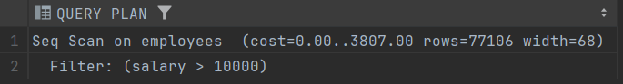

З хінтом

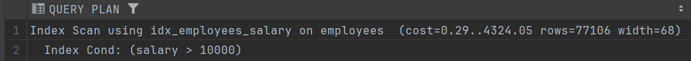

Хінт змушує планувальник використовувати індекс.
## 2.2. JOIN з хінтами
Оцініть план для запиту:
```postgresql
SELECT *
FROM employees e
JOIN cities c ON c.id = e.city_id
WHERE e.salary > 10000;
```

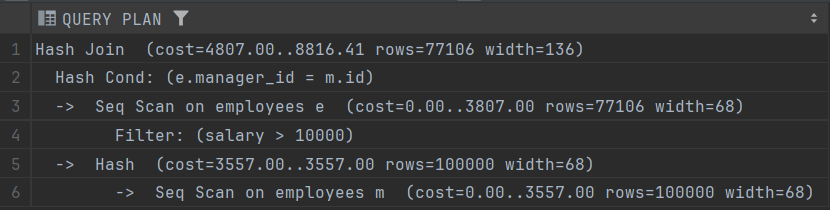

Додайте почергово хінти та порівняйте ці три плани
```postgresql
/*+ HashJoin(e c) */
SELECT ...
```

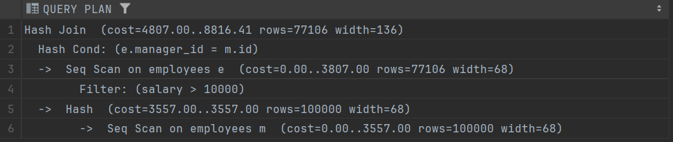

Результат такий же, як і без хінта. Планувальник і без змушення використав HashJoin.
```postgresql
/*+ NestLoop(e c) */
SELECT ...
```

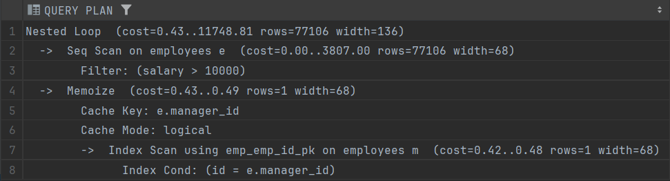

Хінт змушує планувальник використовувати NestLoop.
## Частина 3. Додатковий аналіз
##  3.1. Перевірка статистики
Гляньте що всередині:
```postgresql
SELECT * FROM pg_stat_user_indexes WHERE relname = 'employees';
```

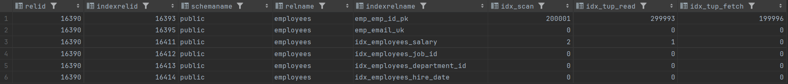

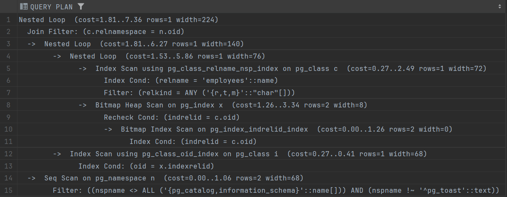
## 3.2. Непрацюючий хінт для IndexOnlyScan
Гляньте план запиту:
```postgresql
/*+ IndexOnlyScan(employees idx_employees_salary) */
SELECT * FROM employees ORDER BY salary;
```
Розкажіть чому навіть з хінтом операція IndexOnlyScan не виконується.

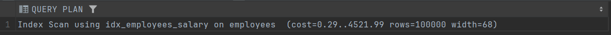

Через те що в результат включаються поля, які не входять в індекс. Щоб виконувалася IndexOnlyScan треба зробити 
```postgresql
/*+ IndexOnlyScan(employees idx_employees_salary) */
SELECT salary FROM employees ORDER BY salary;
```

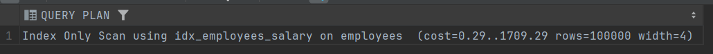
## Частина 4. Додаткове завдання "на 5"
Без цього завдання ви можете отримати максимум 4 бали з 5ти.

З таблиці прикладів хінтів знайдіть ці хінти, самостійно придумайте запити що покажуть доцільність використання цих хінтів 
1. `OR → UNION ALL` - продемонструйте коли доцільно зробити UNION на прикладі
2. `Leading((t1 t2))` - продемонструйте як працює Leading на прикладі

```postgresql
EXPLAIN /*+ Leading((e m)) */ SELECT *
FROM employees e
JOIN employees m ON e.manager_id = m.id
WHERE e.salary > 10000;
```


```postgresql
EXPLAIN /*+ Leading((m e)) */ SELECT *
FROM employees e
JOIN employees m ON e.manager_id = m.id
WHERE e.salary > 10000;
```

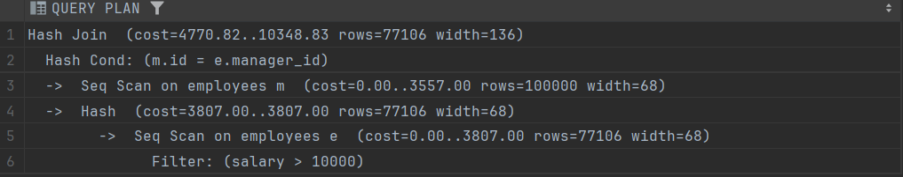

3. `Rows(t1 #100)` - використайте, як варіант, з FunctionScan. Продемонструйте як воно впливає на план запиту на прикладі з JOIN  
4. `work_mem` - гляньте в теорії. Змусьте БД використовувати “external merge” або “disk-based hash” 
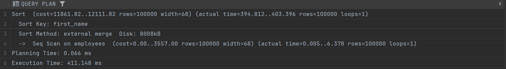
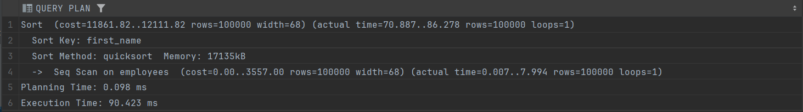