# Частина 1. Створення генерованих колонок
На базі EMPLOYEES створіть 2 генеровані колонки, що будуть вираховувати:
1. Домен з електронної пошти співробітника

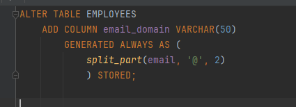

Глянемо в бд:

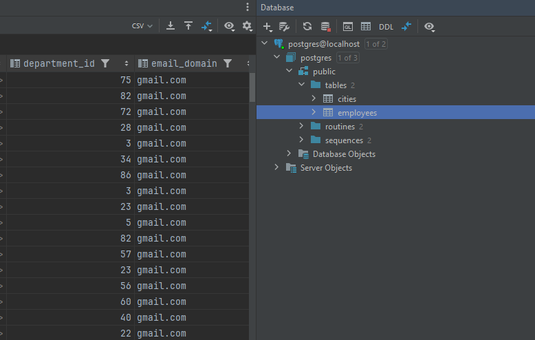

2. ПІБ співробітника == <last_name> || ' ' || <first_name>

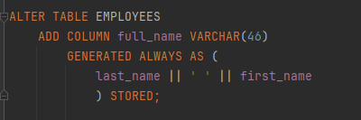

Перевіримо селектом:

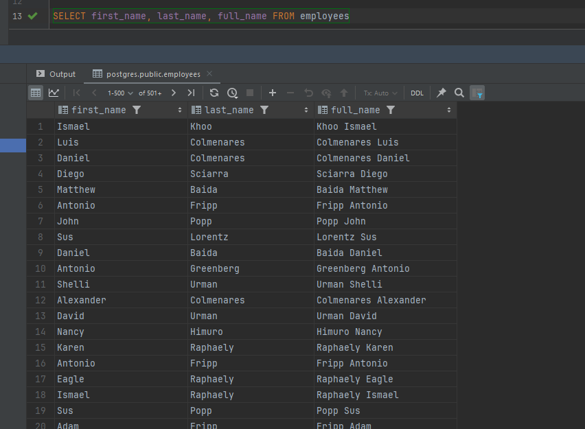

# Частина 2. VIEW
1. Створити ієрархію вгору у вигляді VIEW всіх начальників кожного зі співробітників

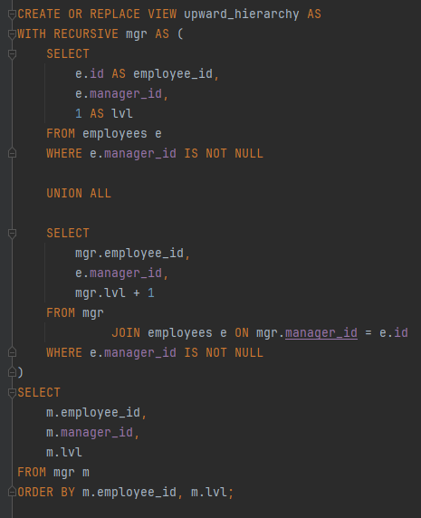

Глянемо в бд:

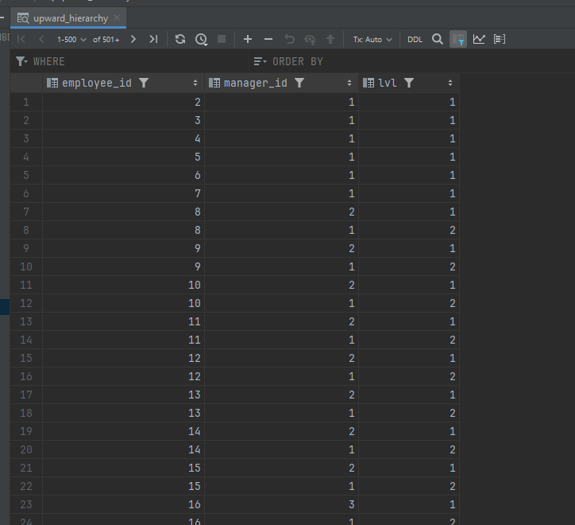

2. Створити ієрархію вниз у вигляді VIEW всіх підлеглих кожного зі співробітників
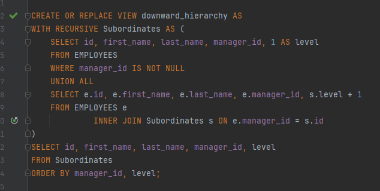

Глянемо в бд:

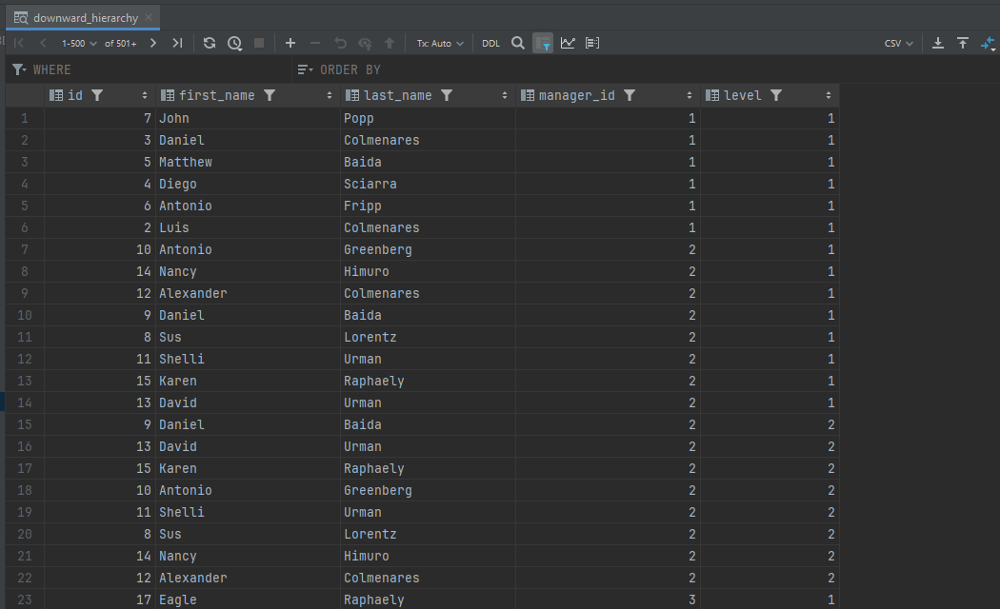

# Частина 3. Materialized VIEW
1. Створити ієрархію вгору у вигляді VIEW всіх начальників кожного зі співробітників

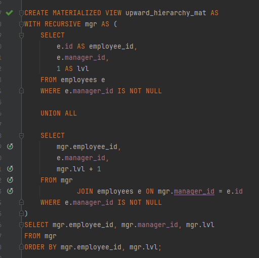
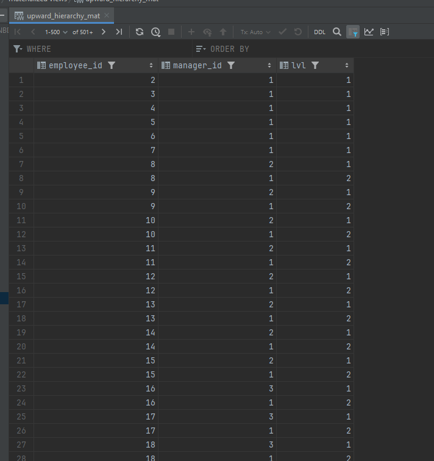

2. Створити ієрархію вниз у вигляді VIEW всіх підлеглих кожного зі співробітників

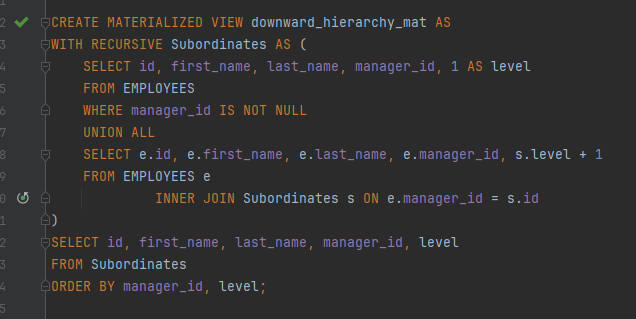
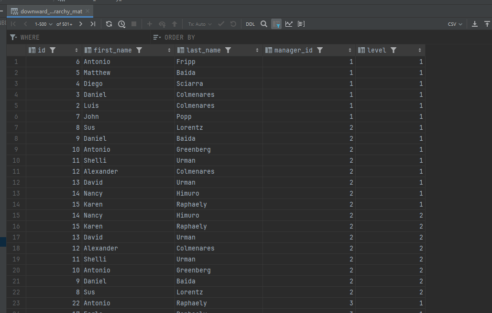

# Частина 4. Порівняння MAT- і просто VIEW
1. Додайте нового співробітника і подивіться план мат-view і просто view з частини 3
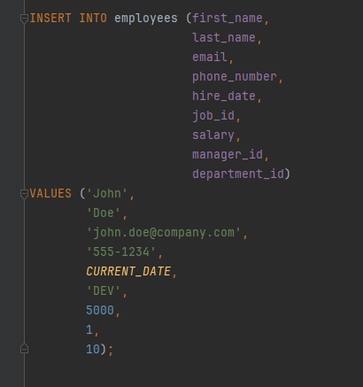
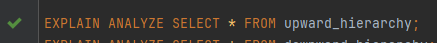
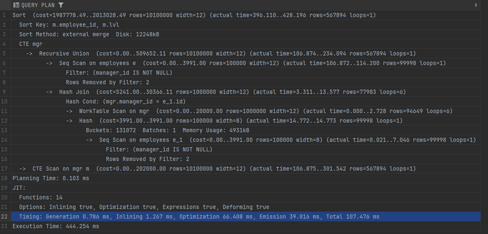

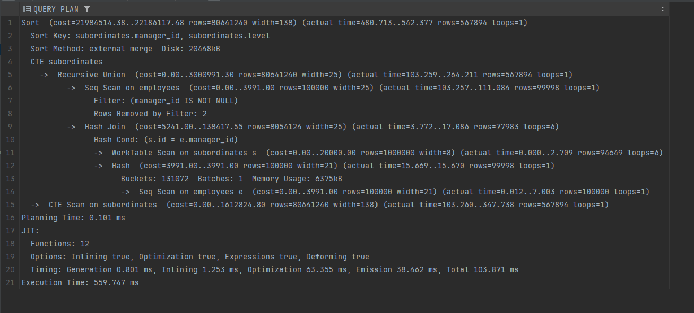
2. Проаналізуйте плани запиту до 2 та 3 частин
## Короткі висновки щодо порівняння планів VIEW та MATERIALIZED VIEW

1. **Upward Hierarchy (звичайний VIEW)**
    - Для кожного запиту СУБД виконує рекурсивний CTE, який знаходить усіх менеджерів «догори».
    - Обсяг результату ~567 тисяч рядків, «вузький» формат (width=12 байтів на рядок).
    - Час виконання ~444 мс, основна затримка — сортування на диску (~12 МБ).
    - Дані завжди актуальні, оскільки результати обчислюються в момент запиту.

2. **Downward Hierarchy (звичайний VIEW)**
    - Аналогічний механізм, але тепер будується ієрархія «донизу».
    - Теж ~567 тисяч рядків, але через «ширший» формат (width=138 байтів) сортування сягає ~20 МБ на диск.
    - Час виконання ~560 мс, що довше, ніж у «догори».
    - Так само забезпечує миттєво оновлювані дані (кожен SELECT вираховує актуальний стан).

3. **MATERIALIZED VIEW**
    - Збережений результат рекурсії — запит `SELECT` просто читає попередньо обчислені дані.
    - При зверненні до матеріалізованого представлення відсутній рекурсивний CTE і масове сортування, тому час виконання суттєво нижчий за 444–560 мс.
    - Дані можуть бути застарілими: для актуалізації потрібна команда `REFRESH MATERIALIZED VIEW`, що повторює складний обчислювальний процес.

4. **Порівняння часу виконання**
    - **VIEW**: кожен раз рахує ієрархію, витрачаючи сотні мілісекунд; однак зміни в таблиці відображаються відразу.
    - **MATERIALIZED VIEW**: віддає результат майже миттєво, але потребує ручного оновлення, яке теж може зайняти ~0.5–1 секунду, залежно від обсягу.

5. **Практичне застосування**
    - Якщо потрібні «живі» дані без відкладення, краще використовувати звичайне VIEW, попри вищі ресурси.
    - Якщо потрібна швидка вибірка однакових даних (наприклад, для звітів), MATERIALIZED VIEW прискорює звернення, але вимагає `REFRESH`, коли з’явилися зміни.

**Підсумок**:
- **Звичайні VIEW** підходять для даних, що змінюються часто та потребують миттєвої актуальності.
- **MATERIALIZED VIEW** зручні для статичних або нечасто змінюваних даних, коли важлива швидкість повторної вибірки.

