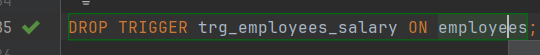

**Примітка**: Лаба на саморозвиток і бали

# Виконання

На базі EMPLOYEES і CITIES створіть тригери, що будуть вести історію змін в таблицях (якусь одну колонку в кожній таблиці). 
Таблиця буде мати три колонки: ID, old_value, new_value. 
ID буде комбіноване - <table_name> + <column_name> + < id >

Створення таблиці, в яку будуть записуватися зміни.

Визначення функції, яка буде викликатися на спрацювання трігеру.

Створення самого трігеру на зміну значення salary таблиці employees.

Стан таблиці, в яку ми записуємо історію змін, до самих змін - таблиця пуста.

Робимо зміни колонки salary та перевіряємо стан таблиці історії.

Видалення трігеру.

Після видалення трігеру, при зміні значення salary, таблиця history не оновлюється.

### Аналогічно для таблиці cities

Функція, яка заповнює таблицю history від таблиці history 

Створення трігеру

Перевірка:

## Висновки

Під час виконання лабораторної роботи, ми ознайомилися з трігерами в базах даних, написали свої трігери та перевірили їх працездатність.
